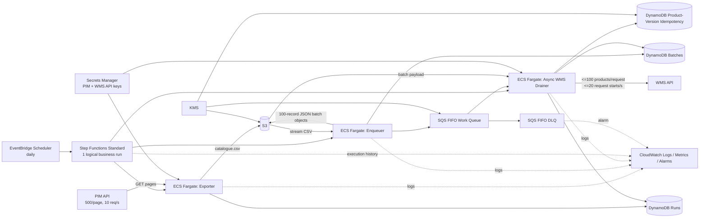

# Product Catalogue Synchronisation — Production Architecture

## 1. Executive summary

The original implementation loads the complete PIM catalogue into memory, writes one local CSV, then loads the complete CSV back into memory before calling the WMS. It has only a single immediate retry, no durable run state, no durable work queue, no bounded concurrency, no reliable recovery boundary, no S3 lifecycle, no production orchestration, and no safe answer to the WMS duplicate requirement.

The proposed design keeps the required daily full export as an immutable business artifact, but turns processing into three restartable stages orchestrated by **AWS Step Functions Standard** and executed as **ECS Fargate** tasks:

1. **Export** — stream paginated PIM data to CSV with a 10 req/s limiter, bounded concurrency, jittered retry, and O(page) application memory; upload the completed source CSV to S3.
2. **Enqueue** — stream the CSV, transform records, create WMS-sized batch objects in S3, persist batch metadata in DynamoDB, and enqueue FIFO SQS pointers.
3. **Drain WMS** — asynchronously consume batches with bounded in-flight concurrency while a single process-wide limiter enforces 20 WMS requests/s. Persist per-product-version idempotency state and per-batch/run outcome counters in DynamoDB.

The choice of one WMS drainer task is intentional. Horizontal worker scaling does not increase the allowed WMS throughput; it only creates a distributed rate-limiting problem. One async process can keep enough calls in flight to saturate the 20 req/s contract even when individual calls take up to about 3 seconds.

## 2. Architecture diagram



## 3. Requirement interpretation and assumptions

The assessment explicitly asks that each ambiguity record the issue, assumption, effect, and what changes if the assumption is false. These are not hidden implementation assumptions.

| Issue | Assumption used | Effect on this design | If the assumption is false |
|---|---|---|---|
| “The same product must never be sent twice” conflicts with a daily full catalogue flow if interpreted literally forever. | “Same product” means the **same product version** (SKU + canonical transformed payload hash) must not be submitted to WMS more than once. | The PIM is still fully exported daily, but unchanged versions already terminal in DynamoDB are skipped. Updated content creates a new version key and is sent. | If WMS requires every SKU every day, WMS must support a run-scoped idempotency key or staging/commit protocol. If duplicate prevention is only per run, include `run_id` in the idempotency key. |
| WMS can time out or return 5xx after a request may have reached it. | A 5xx/timeout is **not proof that nothing committed**. | Default behavior is at-most-once biased: mark the affected versions `AMBIGUOUS`, do not blindly retry, fail the run for reconciliation. | If Warehouse documents that specific 5xx codes are pre-commit, set `RETRY_WMS_5XX=true`. Better: add a WMS idempotency token/status endpoint, then safely retry automatically. |
| WMS 429 semantics are not explicitly stated. | 429 means request rejected before business processing. | 429 is retried with Retry-After/backoff; exhausted 429 releases product claims and requeues safely. | If 429 can commit data, it must be treated as ambiguous like 5xx. |
| Request-level WMS 4xx semantics are not explicitly stated, while record validation failures are documented inside successful responses. | A request-level 4xx means the WMS rejected the request before product application. | Claims are released, the batch is accounted as `request_failed`, and the run fails so operators can fix auth/schema/configuration without permanently poisoning those product versions. | If any request-level 4xx can still commit records, that status must instead be classified as ambiguous and requires Warehouse reconciliation/idempotency support. |
| The supplied mock services intend to return 429/503, but their `JSONResponse` calls pass arguments in the wrong order. | Treat this as a defect in assessment test fixtures, not production API behavior. | The mock branches currently raise `TypeError` and surface as HTTP 500 before WMS product processing. The mocks are left byte-for-byte unchanged; real 429 and 5xx behavior is covered with `httpx.MockTransport` unit tests. | Correct the mock response construction in the fixture owner/source, or run contract tests against a fixed copy outside the submitted mock files. |
| PIM page responses in the supplied mock include `total` and stable numeric page numbers; the prose only guarantees pagination. | Page numbers are stable for one logical export and page 1's total is authoritative for that run. | Pages 2..N can be fetched concurrently while the start rate remains <=10 req/s. | If only cursor chaining is supported, fall back to sequential cursor traversal or ask PIM for snapshot/export-token semantics. The 30-minute SLO may need renegotiation. |
| PIM can change while pages are being read. | The PIM provides logical-run/snapshot consistency even if not explicitly surfaced as a token. | Parallel page reads do not duplicate or omit products due to catalogue mutation. | Require a snapshot ID/as-of timestamp, or export endpoint. Without it, a complete consistent export cannot be proven. |
| SKU uniqueness inside one PIM snapshot is not explicitly stated. | One catalogue snapshot contains at most one row per product ID. | WMS partial responses keyed by SKU can be matched unambiguously. | Validate/deduplicate upstream or require a stronger source key/version contract. |
| Concurrent daily runs would compete for the same external limits. | Only one logical sync should be active. | A DynamoDB active-run **renewable lease** prevents overlap. Each stage refreshes a 120-second lease every 30 seconds; the normal worker releases it. | If overlapping runs are required, use per-run queues plus a distributed global rate limiter and define cross-run ordering/idempotency. |

| Validation-rejected WMS rows may remain invalid until the source changes. | Rejection is terminal for that exact product version. | A small validation failure does not cause successful products to be resent, and the same invalid version is not retried every day. The run may still be `COMPLETED` with a non-zero rejection count. | If business wants automatic re-attempt of unchanged rejected versions, define a retry policy separate from duplicate semantics. |

## 4. Execution flow

### 4.1 Schedule and orchestration

EventBridge Scheduler starts one **Step Functions Standard** execution each morning. Standard was selected instead of Express because the workload can run tens of minutes, requires durable state and auditability, and benefits from exactly-once workflow-state execution semantics. The state machine uses ECS `.sync` integrations so it waits for each Fargate stage without application polling loops.

State sequence:

`Export -> Enqueue -> DrainWMS -> Success`

Any unrecoverable stage error transitions to `FAILED`. Export and enqueue are safe to retry as whole stages because their durable outputs use deterministic run/batch keys. WMS-stage retries are guarded by the product-version idempotency ledger; an uncertain send is quarantined instead of repeated.

### 4.1.1 Run lease and interrupted-run recovery

The active-run record is a **lease, not a permanent mutex**. `Export`, `Enqueue`, and `DrainWMS` all reacquire ownership for the same `run_id` and maintain it with a background heartbeat. Defaults are `RUN_LOCK_SECONDS=120` and `RUN_LOCK_HEARTBEAT_SECONDS=30`. A clean terminal path releases the lock immediately; a hard process/container/VPS termination stops heartbeats and makes the lease reclaimable after at most the lease duration.

Correctness does **not** depend on DynamoDB TTL deleting the active-run item. Acquisition compares a dedicated `lease_expires_at` attribute directly because DynamoDB TTL deletion is asynchronous. The active-lock item intentionally omits the table TTL attribute (`expires_at`); TTL remains cleanup for historical run records, not a correctness mechanism for the lease. When a new run reclaims an expired lease, the prior run record is changed from `RUNNING` to `FAILED` with `failure_type=INTERRUPTED`, `finished_at`, and `recovered_by_run_id` for operator visibility. Terminal messages left on SQS by that abandoned run are deleted when observed by the new worker; the new full export recreates unfinished work, while the product-version ledger skips already accepted/rejected versions and quarantines previous `SENDING` versions as ambiguous rather than risking a duplicate.

This gives automatic recovery from hard interruption without weakening the WMS no-duplicate priority.


### 4.2 Export stage

- Page size is fixed at the PIM maximum: **500**.
- A process-local async start-rate limiter enforces **10 request starts/s**.
- Bounded in-flight concurrency hides the documented 100 ms–3 s response-time variance without violating the rate limit.
- PIM GET 429/5xx/transport failures are safe to retry because GET is read-only. Retries use capped exponential backoff with jitter and honor `Retry-After` when present.
- Rows are written directly to a local ephemeral CSV file page-by-page; the catalogue is never accumulated in a Python list.
- Only after the file is complete is it uploaded to `s3://.../catalogue-sync/exports/<run_id>/catalogue.csv`.
- S3 versioning and KMS encryption are enabled. The `exports/` lifecycle expires data after **90 days**.
- If the stage fails, the run is marked failed and the active-run lock is released.

Why a local ephemeral file before S3 instead of holding bytes in memory: it keeps memory independent of catalogue size, gives the run one reviewable CSV object, and remains well within Fargate ephemeral storage for the expected multi-million-row catalogue. A future very large export can switch to S3 multipart streaming without changing downstream boundaries.

### 4.3 Enqueue / transformation stage

- Download/stream the completed source CSV; do not load it all into memory.
- Transform each record using the existing business mapping.
- Group into at most **100 products**, matching the WMS maximum.
- Persist each batch as a compact JSON object under `catalogue-sync/work/<run_id>/batches/...`.
- Persist batch metadata as `PENDING` in DynamoDB.
- Put only the small S3 pointer on an **SQS FIFO** queue. Each `batch_id` is both message deduplication ID and message group ID. Message visibility is 300 seconds so normal WMS/API retry processing does not redeliver a batch while the first worker still owns it.
- A bounded thread pool overlaps S3/DynamoDB/SQS I/O so creating 20,000 batches does not become a serial network-latency bottleneck.
- Derived `work/` objects expire after 7 days; they are not the 90-day original business export.
- Batch DynamoDB metadata expires after 30 days. Run summaries expire after 400 days. The product-version idempotency ledger has **no TTL** by default because expiring it would allow an old product version to be sent again.

FIFO queue deduplication is useful defense-in-depth, but it is not the business idempotency mechanism because SQS deduplication is time-bounded. DynamoDB is the durable source of truth.

### 4.4 WMS drain stage

One Fargate task runs many async consumers with a shared `WarehouseApiClient` connection pool:

1. Receive a batch pointer from SQS.
2. Read the batch payload from S3.
3. For each product, compute `product_version_key = SKU + SHA-256(canonical transformed payload)`.
4. Conditional-put that key in DynamoDB as `SENDING`.
   - Existing `ACCEPTED` or `REJECTED`: skip as duplicate/already-terminal.
   - Existing `AMBIGUOUS`: do not send.
   - Existing `SENDING` after a redelivery: do not send; conservatively convert to `AMBIGUOUS` because the old process might have crossed the remote-commit boundary.
5. Send only newly claimed products, at <=100 per WMS request.
6. The shared limiter enforces **20 request starts/s**. Up to 80 requests can be in flight so slow responses do not reduce start-rate throughput.
7. On HTTP 200, persist each accepted/rejected record independently.
8. If a success response omits a submitted SKU, mark that SKU ambiguous.
9. Atomically transition the batch to `COMPLETE` and increment run counters using DynamoDB `TransactWriteItems`, so SQS redelivery cannot double-count the batch.
10. Delete the SQS message only after durable outcome recording.

Business validation rejection is not sent to the infrastructure DLQ. It is a known terminal business outcome and is visible in run counters/logs. Poison/infrastructure messages that repeatedly fail eventually move to the DLQ, and the run remains incomplete/failed.

## 5. Duplicate and ambiguous processing

### 5.1 What can be guaranteed with the current WMS contract

The client can guarantee **no intentional resubmission of a product version after it has a terminal or ambiguous ledger state**.

It cannot mathematically guarantee both “every product is applied” and “no product is ever applied twice” across an arbitrary network failure if WMS exposes only a non-idempotent POST. Example:

1. Client sends batch.
2. WMS commits it.
3. Connection drops before the response arrives.
4. Client cannot tell whether commit happened.

Retry risks a duplicate. Not retrying risks a missed product if the commit did not happen. This is the classic ambiguous-outcome problem. The design honors the Warehouse team's no-duplicate priority: **do not retry an ambiguous side effect; surface it for reconciliation**.

### 5.2 Desired WMS contract improvement

The strongest improvement is one of:

- `Idempotency-Key: <product-version-or-batch-key>` with server-side durable deduplication;
- a `GET /operations/<idempotency-key>` status/reconciliation API;
- a staging API plus atomic commit endpoint.

With any of those, 5xx/timeouts can be retried automatically without trading correctness for availability.

## 6. Failure and retry flow

| Failure | Handling |
|---|---|
| PIM 429 | Retry; honor `Retry-After`; jitter/backoff. |
| PIM 5xx/timeout | Safe GET retry with capped attempts. |
| Export task crash | Step Functions retries stage; no WMS side effect has occurred. |
| S3/DynamoDB/SQS transient failure | AWS SDK retry + stage-level retry where the stage is idempotent. |
| Enqueue task crash halfway | Retry scans the source again using deterministic batch IDs/keys. Existing batch metadata is preserved; SQS duplicates are safe due FIFO + downstream ledger. |
| WMS 429 | Retry because assumption says it is pre-processing rejection. If attempts exhaust, release claims and requeue. |
| WMS connection establishment failure | Safe retry; no HTTP request was established. |
| WMS 5xx or timeout after request may have been sent | Mark products `AMBIGUOUS`; no automatic duplicate-risk retry. |
| WMS mixed accepted/rejected response | Persist each SKU outcome separately. Successful SKUs are never reprocessed because another SKU failed validation. |
| Worker process crash before WMS call but after `SENDING` marker | Redelivery becomes conservative `AMBIGUOUS`; this may create a false-positive ambiguity, but it avoids duplicate risk. A WMS idempotency contract removes this compromise. |
| Worker process crash after WMS commit, before ledger update | Redelivery sees `SENDING`, marks ambiguous, does not resend. |
| SQS poison message | After max receives it goes to DLQ; run's completed-batch count stays below total and run fails. |
| Concurrent run attempt | Active-run DynamoDB lease rejects the second run. Export, enqueue and worker heartbeat it; after a hard crash the lease expires, the next run can reclaim it, and the abandoned run is marked `FAILED` with `failure_type=INTERRUPTED`. |
## 7. Throughput and four-year scaling

The external APIs, not AWS compute, set the hard throughput ceiling.

For **2,000,000 products**:

- PIM: `2,000,000 / 500 = 4,000 requests`; at 10 req/s => **400 s = 6m40s minimum**.
- WMS: `2,000,000 / 100 = 20,000 requests`; at 20 req/s => **1,000 s = 16m40s minimum**.
- Because this design intentionally completes the auditable source export before writing WMS, theoretical sequential floor = **23m20s**, before retry, queueing, S3/DynamoDB, and task startup overhead.

The mathematical 30-minute ceiling with no overhead is about **2.57M products**. Reserving even 20% operational headroom puts the practical boundary near **2.06M products**. Therefore the requested four-year assumption of approximately 2M is supportable but already close to the present external-contract limit.

### Roadmap

| Horizon | Catalogue | Plan |
|---|---:|---|
| Now | ~250k | This design has ample margin; establish real p95/p99 latency, retry, and run-duration baselines. |
| ~18 months | ~1M | Expected API-rate floor ~11m40s total. Tune in-flight concurrency and S3/DynamoDB throughput from observed metrics. |
| ~3.5–4 years | ~2M | Expected floor ~23m20s. Treat 30-minute completion as a capacity SLO with alarms; execute WMS contract improvements before this point. |
| Beyond ~2M or higher churn | >2M | Do not solve only by adding Fargate tasks: WMS 20 req/s remains the bottleneck. Negotiate higher WMS rate, add delta/change feed, support snapshot-safe pipeline overlap, or bulk-import endpoint. |

A future pipelined export→WMS flow could reduce the floor toward the slower leg (~16m40s at 2M), but it changes failure semantics: WMS would receive data before the complete export has been proven. Only adopt that after PIM snapshot semantics and WMS idempotency/commit semantics are explicit.

## 8. AWS service choices

- **EventBridge Scheduler** — managed daily trigger with timezone configuration.
- **Step Functions Standard** — durable, auditable, long-running orchestration; ECS `.sync` avoids polling loops.
- **ECS Fargate** — appropriate for tens-of-minutes Python streaming tasks, high connection concurrency, and local Docker parity. Lambda is not required and would add duration/ephemeral-storage constraints without a benefit here.
- **S3** — immutable source export and derived batch payload store; versioned, encrypted, lifecycle-managed.
- **SQS FIFO + DLQ** — durable decoupling and backpressure; FIFO dedup is defense-in-depth.
- **DynamoDB** — conditional writes for idempotency, durable run status, batch exactly-once accounting; on-demand mode handles bursty once-daily workload.
- **Secrets Manager** — API keys are not committed to code/Terraform state.
- **KMS** — customer-managed encryption key for data services.
- **CloudWatch + SNS** — structured logs, metrics, 30-minute execution alarm, workflow-failure alarm, and DLQ alarm. CloudWatch Logs uses its default at-rest encryption; the alarm topic carries operational metadata only.
- **ECR** — immutable/scanned application images.
- **VPC private subnets + per-AZ NAT gateways** — no inbound exposure for tasks while still allowing outbound calls to external PIM/WMS. This costs more than one NAT but removes a single-AZ egress dependency.

## 9. Security and IAM

- Fargate tasks have **no inbound security-group rules** and production egress is restricted to HTTPS/TCP 443.
- API keys are injected from Secrets Manager into task environment at runtime.
- The task role can access only the integration bucket prefix, two SQS queues, three DynamoDB tables, and the KMS key.
- The execution role has only image/log/secret startup permissions.
- Step Functions can run only the configured task-definition revision, pass only the two ECS roles, read/update the run table, and uses wildcard stop/describe only for the dynamically created task ARN (the pattern AWS documents for ECS `.sync`).
- S3 public access is fully blocked; non-TLS S3 requests are denied; bucket versioning and KMS encryption are enabled.
- SQS and DynamoDB use the customer-managed KMS key; DynamoDB point-in-time recovery is enabled. CloudWatch Logs remains encrypted with its AWS-managed default to avoid shipping an incomplete service-principal CMK policy.
- Terraform creates secret **containers**, not secret values, so plaintext API keys do not enter Terraform state. Populate them out-of-band.
- Container image scanning is enabled and tags are immutable in the ECR repository; deploy by digest where possible.
- Logs are JSON to stdout and must not include API keys or full sensitive payloads.

## 10. Observability and operations

Every log line is structured JSON and should include `run_id`, and where relevant `batch_id` and `sku`.

Run state exposes at least:

- `status`: RUNNING / COMPLETED / FAILED
- export key and exported row count
- total/complete batches
- accepted count
- validation-rejected count
- skipped duplicate count
- ambiguous count
- request-level integration failure count
- start/finish timestamps

Operational alarms in Terraform:

- Step Functions `ExecutionsFailed > 0`
- Step Functions `ExecutionTime > 1,800,000 ms` (30 minutes)
- DLQ visible messages > 0

Recommended dashboard additions in a live account: PIM/WMS request count, retry count by status, p50/p95/p99 latency, WMS ambiguous products, SQS age/depth, duplicate-skip rate, validation-rejection rate, exported-products/run, and end-to-end run duration.

Runbook priority:

1. If `AMBIGUOUS > 0`, reconcile with Warehouse before replaying anything.
2. If DLQ > 0, inspect the batch object + structured error, correct infrastructure/data issue, then redrive only after idempotency state is understood.
3. Validation rejects do not require reprocessing accepted products. Correct source data; a new product version can then flow normally.
4. If run time approaches 30 minutes at ~2M, capacity remediation is an external API contract change/delta strategy, not simply more workers.

## 11. Local development and 2M testing

See `LOCAL_DEVELOPMENT.md` for the researched emulator choice and commands.

The repository provides two levels:

- **Fast developer mode:** real mock PIM/WMS + filesystem/in-memory AWS boundaries.
- **AWS-emulation mode:** LocalEmu 1.2.0 + Terraform for KMS, S3, SQS/DLQ, DynamoDB, Secrets Manager, IAM, CloudWatch, SNS, ECR/ECS control plane, Step Functions, Scheduler, STS and a minimal VPC. The application stages run as host processes against those durable emulated AWS services for the default E2E. LocalEmu documents real Docker-backed ECS/Fargate and Step Functions `ecs:runTask.sync`, but its current ECS secret-injection and `awslogs` gaps are explicitly not hidden; `infra/aws` remains the production source of truth.

The supplied mocks were not modified (their SHA-256 hashes match the original repository). A live process-level E2E run against them completed 12,000 products / 120 WMS batches with 11,988 accepted and 12 validation rejections. Because the mocks currently surface their intended 429/503 branches as 500s due to the fixture bug documented above, unit tests separately verify true 429 and 503 semantics.

A streaming local capacity test is included:

```bash
python scripts/loadtest.py --records 2000000
```

In the completion environment this generated/scanned 2,000,000 rows as 20,000 batches with a ~130.5 MB CSV in about 8.3 wall-clock seconds and ~93 MB process peak RSS. This validates that application memory does not scale with the full catalogue. It does **not** bypass the WMS contract: a real 2M end-to-end soak is intentionally rate-limited and therefore needs at least ~16m40s for the WMS leg.

## 12. Engineering frameworks condensed into this design

### AWS Well-Architected Framework

Applied across all six pillars:

- **Operational Excellence:** IaC, run state, structured logs, alarms, runbooks, explicit unfinished work.
- **Security:** least privilege, private tasks, managed secrets, encryption, no public S3.
- **Reliability:** durable queues/state, retries only when safe, DLQ, idempotency ledger, failure boundaries.
- **Performance Efficiency:** streaming, bounded async concurrency, rate-limit saturation rather than unlimited workers.
- **Cost Optimization:** on-demand DynamoDB, three short-lived Fargate tasks, lifecycle expiration, no always-on worker fleet.
- **Sustainability:** work scales with actual run duration; derived data expires; no overprovisioned permanent compute.

### AWS Well-Architected Serverless Applications Lens

Although compute uses Fargate, the control plane is event-driven/serverless. The design follows the lens principles to orchestrate with state machines, keep durable state outside compute, and design for failures/duplicates.

### Amazon Builders' Library reliability patterns

Remote calls use explicit timeouts, capped retries, exponential backoff and jitter. The design distinguishes safe retries from non-idempotent ambiguous side effects rather than applying the same retry policy everywhere.

### Google SRE practices

The 30-minute expectation is treated as a measurable SLO/capacity boundary. Monitoring is designed first to answer “is the business run healthy?” and then to provide diagnostics (latency, retries, queue age, validation/ambiguity counts) for root cause and capacity planning.

## 13. Important trade-offs

1. **Correctness over aggressive recovery for ambiguous WMS writes.** This can leave products needing manual reconciliation, but blindly retrying violates the stated duplicate priority.
2. **Stage barrier after export.** Gives a complete immutable business artifact before side effects, but consumes ~6m40s of the 2M time budget before WMS begins.
3. **Single WMS worker task.** Simpler global rate limiting and lower cost; the external 20 req/s cap means more tasks do not improve throughput. The task still uses high internal concurrency.
4. **S3 batch pointers instead of full SQS payloads.** More S3 PUTs, but avoids coupling correctness to message-size limits as product schemas grow.
5. **Durable per-product-version ledger.** Adds DynamoDB write cost, but is required to make duplicate semantics explicit across retries/runs.
6. **Two NAT gateways.** Higher fixed cost, but avoids losing all outbound integration traffic on one AZ failure. A lower-criticality environment can use one NAT as a documented cost/reliability trade-off.

## 14. Research basis

Official sources used while designing this submission:

- LocalEmu repository: https://github.com/localemu/localemu
- LocalEmu Terraform integration: https://localemu.cloud/docs/terraform
- LocalEmu service coverage: https://localemu.cloud/docs/services/
- LocalEmu Step Functions: https://localemu.cloud/docs/stepfunctions
- LocalEmu ECS: https://localemu.cloud/docs/ecs
- LocalEmu Scheduler: https://localemu.cloud/docs/scheduler
- LocalEmu IAM enforcement: https://localemu.cloud/docs/iam-enforcement/
- AWS Well-Architected Framework: https://docs.aws.amazon.com/wellarchitected/latest/framework/
- AWS Reliability Pillar: https://docs.aws.amazon.com/wellarchitected/latest/reliability-pillar/
- Serverless Applications Lens: https://docs.aws.amazon.com/wellarchitected/latest/serverless-applications-lens/
- Step Functions workflow types: https://docs.aws.amazon.com/step-functions/latest/dg/choosing-workflow-type.html
- Amazon SQS at-least-once delivery: https://docs.aws.amazon.com/AWSSimpleQueueService/latest/SQSDeveloperGuide/standard-queues-at-least-once-delivery.html
- DynamoDB conditional writes: https://docs.aws.amazon.com/amazondynamodb/latest/developerguide/Expressions.ConditionExpressions.html
- Amazon Builders' Library — timeouts/retries/backoff/jitter: https://builder.aws.com/content/3EumjoZascWd1oZiEgL8ORlv3qE/timeouts-retries-and-backoff-with-jitter
- Amazon Builders' Library — idempotent APIs: https://aws.amazon.com/builders-library/making-retries-safe-with-idempotent-APIs/
- ECS private subnet/NAT guidance: https://docs.aws.amazon.com/AmazonECS/latest/developerguide/networking-outbound.html
- Google SRE monitoring/SLO material: https://sre.google/workbook/monitoring/ and https://sre.google/resources/book-update/slos/
