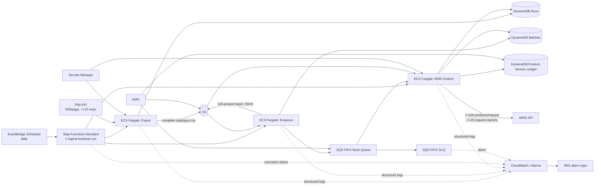

# Product Catalogue Synchronisation — Production Architecture

## 1. Executive summary

The challenge requires a daily, reviewable full catalogue export from PIM to WMS at approximately **250,000 products today** and **1 million products within 18 months**, with a normal completion target of **30 minutes**, robust recovery, partial-failure isolation, and a strict business concern that the same product must not be sent twice.

The production design keeps the full CSV as the immutable business artifact and splits processing into three durable stages orchestrated by **AWS Step Functions Standard** and executed as **ECS Fargate** tasks:

1. **Export** — page through PIM at its 10 request/s limit, stream rows to CSV, then upload the complete source export to S3.
2. **Enqueue** — stream the CSV, transform rows, persist WMS-sized batch payloads to S3, record batch metadata in DynamoDB, and enqueue small SQS FIFO pointers.
3. **Drain WMS** — consume batches with bounded concurrency and a shared 20 request/s limiter, recording product-version idempotency and accepted/rejected/ambiguous outcomes in DynamoDB.

This architecture separates failure domains and keeps durable state outside compute. It does **not** claim that Step Functions' exactly-once workflow execution makes the external WMS POST exactly once. External side-effect ambiguity remains a WMS contract issue and is handled conservatively.

The attached code demonstrates the important architecture, but one high-priority worker gap remains: it has no per-message SQS visibility heartbeat and can prefetch received messages into an internal queue long enough for receipt handles to expire before deletion. That gap is documented rather than hidden; see `UNFINISHED.md`.

## 2. Architecture diagram



## 3. Requirement interpretation and explicit assumptions

The assignment asks for the issue, assumption, effect, and what changes if the assumption is wrong. The important ambiguities are therefore explicit:

| Issue | Assumption | Effect | If assumption is false |
|---|---|---|---|
| “The same product must never be sent twice” is technically underspecified. | Duplicate prevention applies to the same **product version**: SKU plus canonical transformed-payload hash. | Unchanged terminal versions are skipped across runs; changed payload creates a new version key. | If WMS expects every SKU every day or only run-scoped deduplication, the keying strategy must change. Best solution is a WMS idempotency key/status API. |
| A WMS timeout/5xx can occur after the request may have reached WMS. | 5xx/timeout is not proof of non-commit. | Default behavior marks the affected claimed versions `AMBIGUOUS` rather than blindly resending. | If Warehouse guarantees selected statuses are pre-commit, those statuses can be safely retried. |
| WMS 429 semantics are not specified. | 429 means rejected before business processing. | Retry with `Retry-After`/backoff; release claims and requeue if safe retries exhaust. | Treat 429 as ambiguous if it can commit. |
| Request-level WMS 4xx differs from record-level business rejection returned inside a success response. | Request-level 4xx is pre-application integration/configuration rejection. | Release claims, count `request_failed`, fail run for correction. | If request-level 4xx can partially commit, classify it as ambiguous. |
| PIM page 1 in the supplied mock has stable numeric pages and `total`. | Numeric pages are stable for one logical export and `total` is authoritative for that snapshot. | Pages 2..N can be fetched concurrently while respecting the 10 req/s start rate. | Use cursor chaining or require a snapshot/export token. |
| PIM may change while pages are being read. | Real PIM provides snapshot/logical-run consistency. | Parallel page reads represent one coherent business export. | Require snapshot/as-of semantics; otherwise completeness cannot be proven. |
| Only one daily logical sync should be active. | Overlapping runs are not required. | A DynamoDB renewable active-run lease rejects overlap and allows takeover after hard failure. | Use per-run queues plus a cross-run global rate limiter and define ordering/idempotency. |
| Validation-rejected rows can remain invalid until source data changes. | Rejection is terminal for that exact product version. | Valid products are not resent because one row is invalid. | Define a separate retry policy for unchanged rejected versions. |
| The repository includes a 2M test. | 2M is an **extra stress/headroom scenario**, not a requirement from the supplied challenge text. | It is used to expose memory and external-rate ceilings beyond the stated 1M/18-month horizon. | Remove the stress scenario if only strict assignment scope is desired. |

The supplied mock services also contain malformed `JSONResponse` calls in their intended 429/503 branches. The repository leaves mock code unchanged in this documentation-only pass and tests true HTTP status semantics independently.

## 4. Execution and data flow

### 4.1 Schedule and orchestration

EventBridge Scheduler starts a **Step Functions Standard** execution each morning. Standard is appropriate for a long-running durable/auditable workflow and supports ECS `.sync` integrations. AWS describes Standard workflow execution as exactly-once unless explicit retries are configured; the state machine in this repository does configure bounded retries for failed ECS tasks. That orchestration guarantee must not be confused with exactly-once execution of an external WMS side effect.

State sequence:

```text
Export -> Enqueue -> DrainWMS -> ReadRunStatus -> Success/Fail
```

`infra/aws` retries failed ECS tasks with bounded backoff and then marks the run failed if the stage remains unsuccessful.

### 4.2 Renewable run lease

The active-run record is a renewable lease, not a permanent mutex:

- default `RUN_LOCK_SECONDS=120`
- default `RUN_LOCK_HEARTBEAT_SECONDS=30`
- active record stores `owner`, `heartbeat_at`, and `lease_expires_at`
- normal completion releases the lock
- hard termination stops the heartbeat; a later run can conditionally take over after expiry
- takeover marks the prior `RUNNING` owner `FAILED` with `failure_type=INTERRUPTED` and `recovered_by_run_id`

Correctness does not depend on DynamoDB TTL deleting the lock item. TTL remains historical cleanup, while takeover compares the lease timestamp directly.

### 4.3 Export stage

- PIM page size: 500.
- Shared async start-rate limiter: <=10 request starts/s.
- Bounded concurrency hides 100ms–3s latency variance without increasing the start rate.
- GET 429/5xx/transport failures are retried with bounded backoff/jitter and `Retry-After` where available.
- Rows stream to a local ephemeral CSV; the catalogue is not accumulated in a Python list.
- Only a complete file is uploaded to `catalogue-sync/exports/<run_id>/catalogue.csv`.
- S3 versioning/KMS are enabled in production Terraform.
- `exports/` has a 90-day lifecycle, satisfying the challenge's retention requirement.

A local ephemeral file is a pragmatic implementation boundary at the stated scale. If export size grows materially, multipart streaming to S3 can replace it without changing downstream contracts.

### 4.4 Enqueue/transform stage

- Download and stream the completed source CSV.
- Transform one row at a time.
- Group at most 100 products per WMS-sized batch.
- Persist each batch payload under `catalogue-sync/work/<run_id>/batches/...` in S3.
- Persist batch metadata in DynamoDB.
- Send an SQS FIFO pointer containing run/batch/S3-key metadata, not the whole business payload.
- Deterministic `batch_id` is used as message group/deduplication ID.
- A bounded thread pool overlaps S3/DynamoDB/SQS I/O.
- Derived `work/` objects expire after 7 days; the original export remains 90 days.
- Run/batch metadata uses TTL cleanup; the product-version ledger intentionally has no TTL because expiring it can re-enable an old duplicate.

FIFO deduplication is only defense-in-depth. The durable business idempotency decision lives in DynamoDB.

### 4.5 WMS drain stage

For each received batch pointer the worker currently:

1. reads the batch JSON from S3;
2. computes a product-version key for each product;
3. conditionally claims each unseen version as `SENDING`;
4. skips prior `ACCEPTED`/`REJECTED` versions;
5. does not resend prior `AMBIGUOUS` versions;
6. treats a redelivered prior `SENDING` claim conservatively as ambiguous;
7. sends newly claimed products in batches of <=100;
8. applies a shared 20 request/s limiter and bounded HTTP concurrency;
9. records accepted/rejected/ambiguous outcomes per product;
10. atomically marks the batch complete and increments run counters with DynamoDB `TransactWriteItems`;
11. deletes the SQS message after durable accounting.

Business validation rejection is a terminal business outcome, not infrastructure poison, and therefore does not go to the DLQ by itself.

### 4.6 Current SQS lifecycle gap

The current implementation sets `VisibilityTimeout` on `ReceiveMessage`, but it does **not** extend visibility while a long-running batch is being processed. It also allows messages to be received and buffered in an internal `asyncio.Queue`, so the visibility clock can run while a message is waiting for an available consumer.

That means a slow/local run can reach this sequence:

```text
ReceiveMessage
  -> visibility timer starts
  -> local prefetch wait
  -> product-ledger work
  -> WMS/outcome writes
  -> complete_batch succeeds
  -> DeleteMessage uses an expired receipt handle
```

This is a real reliability gap, not merely a LocalEmu cosmetic difference. The required production fix is to add per-message `ChangeMessageVisibility` renewal while work is owned, reduce/bound prefetch to processing capacity, and regression-test post-completion redelivery. It is listed as priority P0 in `UNFINISHED.md`.

## 5. Duplicate and ambiguous processing

### 5.1 Guarantee achievable with the stated WMS API

The client can guarantee that it does not **intentionally** resubmit a product version after that version is recorded terminal or ambiguous.

It cannot guarantee both “every product is applied” and “no product is ever applied twice” across an arbitrary network failure when WMS only exposes a non-idempotent POST:

1. client sends;
2. WMS commits;
3. response is lost;
4. client cannot know whether commit occurred.

Retry risks duplication; no retry risks omission. The current design prioritizes the explicit no-duplicate concern and surfaces the uncertain version for reconciliation.

### 5.2 Desired WMS contract improvement

Preferred options:

- durable `Idempotency-Key` support;
- operation-status lookup by idempotency key;
- staging plus atomic commit.

Any of these would allow safe automated retries after uncertain transport outcomes.

## 6. Failure and retry flow

| Failure | Handling / intended handling |
|---|---|
| PIM 429 | Retry, honor `Retry-After`, bounded backoff/jitter. |
| PIM 5xx/timeout | Safe GET retry with capped attempts. |
| Export task crash | Step Functions stage retry; no WMS side effect has occurred. |
| Enqueue task crash | Re-run deterministic batch creation; downstream ledger handles duplicate delivery. |
| AWS SDK transient failure | Standard SDK retry plus stage-level retry where safe. |
| WMS 429 | Retry under documented pre-commit assumption. |
| WMS connection establishment failure | Safe retry. |
| WMS 5xx/timeout after transmission may have begun | Mark affected claims ambiguous; do not blind-retry by default. |
| WMS mixed accepted/rejected success | Persist each SKU independently. |
| Worker crash with a `SENDING` product claim | Redelivery avoids resend and conservatively marks uncertainty. |
| Batch already durably complete but SQS redelivers | DynamoDB batch transaction prevents double-counting; product ledger prevents resend. The message should then be deleted with the new receipt handle. |
| SQS visibility expires before delete | **Current unfinished gap:** receipt can become invalid/redelivered; needs per-message visibility renewal/bounded prefetch. |
| Poison/infrastructure message | SQS redrive policy eventually moves repeated failures to DLQ. |
| Concurrent run | DynamoDB lease rejects overlap; expired lease can be reclaimed and prior owner marked interrupted. |

## 7. Throughput and scaling

The external systems define the first-order throughput ceiling.

### 7.1 Stated 1M-product horizon

For **1,000,000 products**:

- PIM: `1,000,000 / 500 = 2,000 requests`; at 10 req/s => **200s = 3m20s** minimum request-start time.
- WMS: `1,000,000 / 100 = 10,000 requests`; at 20 req/s => **500s = 8m20s** minimum request-start time.
- Because the design intentionally completes the full export before WMS writes, the sequential external-rate floor is **11m40s** before response latency, retries, S3/DynamoDB work and task startup.

That provides meaningful theoretical margin against 30 minutes, but the margin must be validated with production-like latency and AWS state-write costs.

### 7.2 Optional 2M stress scenario

For **2,000,000 products**:

- PIM floor: **6m40s**
- WMS floor: **16m40s**
- sequential external-rate floor: **23m20s**

This is close enough to 30 minutes that internal state-write overhead and retries become material. The included `scripts/loadtest.py` only proves streaming memory behavior; it does not prove that the full AWS/WMS pipeline meets 30 minutes at 2M.

### 7.3 Internal state-write capacity risk

The worker currently performs product-ledger operations per product. At large scale this means millions of DynamoDB calls in addition to the external API floor. Production validation must therefore measure:

- claim/update latency and throttling;
- DynamoDB request volume/cost;
- worker CPU/thread-pool saturation;
- queue age and receipt visibility lifetime;
- actual p95/p99 WMS latency;
- end-to-end run duration.

If 1M approaches the SLO in realistic tests, optimize ledger I/O/concurrency and/or negotiate external API improvements before relying on the 2M stress scenario.

## 8. AWS service choices

- **EventBridge Scheduler** — managed daily trigger with timezone support.
- **Step Functions Standard** — durable/auditable orchestration and ECS `.sync` support.
- **ECS Fargate** — long-running Python workloads, streaming files, high connection concurrency, no host management.
- **S3** — immutable source export and derived batch payloads; versioning/encryption/lifecycle.
- **SQS FIFO + DLQ** — durable work decoupling/backpressure; FIFO deduplication as defense-in-depth.
- **DynamoDB** — conditional product-version claims, run/batch state, atomic batch/run accounting; on-demand billing for bursty daily work.
- **Secrets Manager** — external API credentials outside source and production Terraform values.
- **KMS** — customer-managed encryption key for production data services.
- **CloudWatch + SNS** — logs, workflow failure, duration and DLQ alarms; external incident subscription intentionally deployment-specific.
- **ECR** — immutable/scanned application images.
- **VPC private subnets + per-AZ NAT** — no inbound task exposure while permitting outbound PIM/WMS access.

## 9. Security and IAM

- Fargate tasks have no inbound security-group rules.
- Production task egress is restricted to HTTPS.
- PIM/WMS keys are injected from Secrets Manager.
- Task role is limited to the integration bucket, queues, DynamoDB tables and KMS key required by the application.
- Execution role is limited to image/log/secret startup needs.
- Step Functions can run the configured task definition and pass only the required ECS roles.
- S3 public access is blocked; production S3 denies non-TLS requests.
- Production S3/SQS/DynamoDB use KMS-backed encryption; DynamoDB PITR is enabled.
- Production Terraform creates secret containers, not plaintext API-key values.
- ECR scanning and immutable tags are enabled.
- Structured logs must never include credentials or complete sensitive payloads.

## 10. Observability and operations

Run state provides the business-level answer to “running, completed or failed” and includes or derives:

- run status;
- export object/count;
- total/completed batches;
- accepted count;
- validation-rejected count;
- skipped duplicate count;
- ambiguous count;
- request-level failure count;
- heartbeat/start/finish information.

Terraform includes alarms for:

- Step Functions execution failure;
- execution time above 30 minutes;
- visible messages in the DLQ.

Recommended production dashboard additions: PIM/WMS request/retry rate, p50/p95/p99 latency, WMS ambiguity count, SQS age/depth/in-flight count, product-version skip rate, validation rejection rate, DynamoDB throttling/latency, exported products and end-to-end duration.

Runbook order:

1. If `AMBIGUOUS > 0`, reconcile with Warehouse before any replay.
2. If DLQ > 0, inspect durable batch payload/state before redrive.
3. Validation-rejected products do not require replay of accepted products.
4. If receipt visibility is close to processing time, treat it as a reliability defect, not a reason to keep increasing a static timeout indefinitely.
5. If realistic 1M duration approaches 30 minutes, optimize internal state I/O and negotiate external API capability/rate before scaling compute blindly.

## 11. Local development and validation scope

The repository supports:

- **fast developer mode** — mock PIM/WMS + filesystem/in-memory state;
- **LocalEmu mode** — Terraform-provisioned S3/SQS/DynamoDB/KMS and broader AWS control-plane smoke coverage, while application stages run as host processes against the emulated data services.

The attached ZIP's unit suite was executed during this review and produced:

```text
54 passed
```

The repository includes:

```bash
python scripts/loadtest.py --records 2000000
```

That command generates and scans a local CSV and reports file size, generation time, transform/scan time and peak RSS. It does not call AWS services or the external APIs.

The full durable LocalEmu business E2E is intentionally **not** described as a clean success while the SQS visibility/receipt-lifecycle gap remains. See `LOCAL_DEVELOPMENT.md` for the temporary local workaround and `UNFINISHED.md` for the required code fix.

## 12. Engineering principles applied

### AWS Well-Architected

- **Operational Excellence:** IaC, explicit run status, structured logs, alarms, runbook, unfinished-work register.
- **Security:** least privilege, private tasks, managed secrets, encryption, blocked public S3.
- **Reliability:** durable queue/state, conservative retry semantics, DLQ, product-version ledger, renewable run lease.
- **Performance Efficiency:** streaming, bounded concurrency, explicit external-rate ceilings.
- **Cost Optimization:** short-lived Fargate tasks, on-demand DynamoDB, lifecycle expiration, no permanent worker fleet.
- **Sustainability:** processing exists only for scheduled work; derived artifacts expire.

### Amazon Builders' Library / SRE-style reliability

The design uses explicit timeouts, bounded retries with backoff/jitter, external-side-effect idempotency reasoning, and a measurable 30-minute business SLO. The unfinished SQS visibility issue is exactly the kind of failure-boundary defect that should be made observable and corrected rather than masked with optimistic documentation.

## 13. Important trade-offs

1. **Correctness over aggressive retry for ambiguous WMS writes.** Manual reconciliation can be required, but blind retry would violate the strongest stated duplicate concern.
2. **Full-export barrier before WMS side effects.** Produces a complete reviewable 90-day artifact but consumes part of the duration budget before WMS starts.
3. **Single WMS drainer process.** Simplifies global rate limiting because WMS is capped at 20 starts/s; internal concurrency hides latency without adding distributed rate-limit coordination.
4. **S3 batch pointers instead of full SQS payloads.** More S3 objects, but payload size is not coupled to SQS limits and batch data remains inspectable.
5. **Durable product-version ledger.** Adds DynamoDB cost/latency but makes duplicate semantics explicit across retries/runs.
6. **Conservative `SENDING` crash semantics.** Can create false-positive ambiguity but avoids resending a potentially committed product.
7. **Two production NAT gateways.** Higher fixed cost in exchange for avoiding a single-AZ outbound dependency.

## 14. Research references

Official/reference material used by the repository design:

- LocalEmu repository: https://github.com/localemu/localemu
- AWS Step Functions workflow types: https://docs.aws.amazon.com/step-functions/latest/dg/choosing-workflow-type.html
- Amazon SQS visibility: https://docs.aws.amazon.com/AWSSimpleQueueService/latest/APIReference/API_ChangeMessageVisibility.html
- DynamoDB conditional writes: https://docs.aws.amazon.com/amazondynamodb/latest/developerguide/Expressions.ConditionExpressions.html
- AWS Well-Architected Framework: https://docs.aws.amazon.com/wellarchitected/latest/framework/
- Amazon Builders' Library — retries/backoff/jitter: https://aws.amazon.com/builders-library/timeouts-retries-and-backoff-with-jitter/
- Amazon Builders' Library — idempotent APIs: https://aws.amazon.com/builders-library/making-retries-safe-with-idempotent-APIs/
- ECS outbound networking: https://docs.aws.amazon.com/AmazonECS/latest/developerguide/networking-outbound.html
